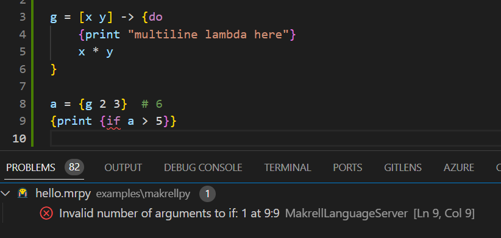

# Makrell 


Makrell is a family of programming languages implemented in Python. It consists currently of these languages:

* **MakrellPy**, a general-purpose, functional programming language with two-way Python interoperability, metaprogramming support and simple syntax.
* **MRON** (Makrell Object Notation), a lightweight alternative to JSON.
* **MRML** (Makrell Markup Language), a lightweight alternative to XML and HTML.
* **Makrell Base Format (MBF)**,  a simple data format that forms the basis for both MakrellPy, MRON and MRML.

The project is in an early stage of development and is not yet ready for production use.

Website and documentation: **[makrell.dev](https://makrell.dev)**

Community: **[Chat on Gitter](https://app.gitter.im/#/room/#makrell:gitter.im)**

## Quick Start

### Installation

```bash
pip install makrell
```

### MakrellPy REPL usage

```bash
makrell
> 2 + 3
5
> [2 3 5] | sum
10
```

### Run a MakrellPy script

```bash
makrell myscript.mr
```

## IDE Support

MakrellPy is supported by the MakrellPy Language Server, included in the Makrell package. The language server is based on the [LSP](https://microsoft.github.io/language-server-protocol/) protocol and can be used with any LSP-compatible editor, such as Visual Studio Code, Sublime Text, Atom, Vim, Emacs etc. A VS Code extension is available [here](https://marketplace.visualstudio.com/items?itemName=hcholm.vscode-makrell).




## MakrellPy

The following is a quick introduction by example to the MakrellPy language. See [examples](examples) and [tests](tests) for more code examples.

### Syntax

MakrellPy uses the Makrell Base Format as its base syntax (see below). MakrellPy-specific syntax is built on top of this. The following is a simple example of a MakrellPy program:

```
# This is a comment.
a = 2
b = a + 3
{sum [a b 5]}  # function call
[a b 5] | sum  # function call by pipe operator
sum \ [a b 5]  # function call by reverse pipe operator

# Conditional expression
{if a < b
    "a is less than b"
    "a is not less than b"}

# Function definition
{fun add [x y]
    x + y}

# Partial application
add3 = {add 3 _}
{add3 5}  # 8

# Operators as functions
a = 2 | {+ 3} | {* 5}  # 25

# Pattern matching, user extensible through metaprogramming
{match a
    2
        "two"
    [_ 3|5]
        "list with two elements, second is 3 or 5"
    _:str
        "a string"
    _ 
        "something else"
}

# Custom operators with precedence levels
{operator *_* 100
    $left + $right + 1}
{operator *+* 90
    $left - $right}
a = 2 *+* 3 *_* 5
a | print
{assert a == -7}
b = 2 | {*_* 3}
b | print
{assert b == 6}

# a macro that evaluates expressions in reverse order
{def macro reveval [ns]
    ns = ns | regular | operator_parse
    {print "[Compile time] Reversing {ns | len} expressions"e}

    [{quote {print "This expression is added to the code"}}]
    + (ns | reversed | list)
}

{print "Starting"}
{reveval
    "a is now {a}"e | print
    a = a + 3
    "a is now {a}"e | print
    a = 2
}
{print a}  # 5
{print "Done"}

# Output:
# [Compile time] Reversing 4 expressions
# Starting
# This expression is added to the code
# a is now 2
# a is now 5
# 5
# Done
```

Note:
* The syntax is determined by lists and binary expressions.
* Return values are implicit, i.e. the last expression in a block is the return value.

### Other Features

See the [examples](examples) and [tests](tests) directories for examples of the following features:
* Class definitions
* String interpolation
* A variety of literal values
* Async/await
* More functional programming features
* More metaprogramming features
* Python interoperability
* LSP (Language Server Protocol) support

## MRON

Sample MRON document:

```
owner "Rena Holm"
last_update "2023-11-30"

books [
    {
        title  "That Time of the Year Again"
        year   1963
        author "Norton Max"
    }
    {
        title  "One for the Team"
        year   2024
        author "Felicia X"
    }
]
```

The above code corresponds to the following Python dictionary tree:

```python
{
    "owner": "Rena Holm",
    "last_update": "2023-11-30",
    "books": [
        {
            "title": "That Time of the Year Again",
            "year": 1963,
            "author": "Norton Max"
        },
        {
            "title": "One for the Team",
            "year": 2024,
            "author": "Felicia X"
        }
    ]
}
```

It's possible to embed MakrellPy code in MRON documents, and vice versa. Example:

```
a 2
b {$ 3 + 5 }
```

This will be evaluated to this Python dictionary:

```python
{
    "a": 2,
    "b": 8
}
```

## MRML

Sample MRML document:

```
{html
    {head
        {title A Test}
    }
    {body
        {h1 This is a Test}
        {p [style="color: red"] Just some {b bold} text here.}
    }
}
```

The above code corresponds to the following HTML:

```html
<html>
    <head>
        <title>A Test</title>
    </head>
    <body>
        <h1>This is a Test</h1>
        <p style="color: red">Just some <b>bold</b> text here.</p>
    </body>
</html>
```

It's possible to embed MakrellPy code in MRML documents, and vice versa. Example:

```
{a [b = {$ [2 3 5 7] | sum}] asd}
```

This will be evaluated to:

```html
<a b="17">asd</a>
```


## Makrell Base Format

The Makrell Base Format is a simple data format that forms the basis for both MakrellPy, MRON and MRML. It is a simple text-based format that is easy to read and write. It is designed to be easy to parse and generate, and to be easy to work with in a text editor.

These element types are supported:

* **Identifier**: A simple name. Examples:
    * `x`
    * `Y1`
    * `$Example_Æ23`.
* **String**: A sequence of characters surrounded by double quotes. The backslash character is used to escape double quotes and backslashes. A string may have a suffix that specifies an implementation-specific data type. Examples:
    * `"Hi."`
    * `"This is a string: \"Hi.\""`
    * `"2024-02-02"date` : a date
    * `"12AF"hex` : a hexadecimal number
* **Number**: A numeric value. As with strings, a number may have a suffix that specifies an implementation-specific data type or value. Examples:
    * `42`
    * `2.5e9`
    * `2.5G` = 2,500,000,000
    * `2pi` = 6.283185307179586
* **List**: A sequence of elements, surrounded by brackets and usually separated by spaces. Lists may be nested. There are three types of lists:
    * **"Round"**, e.g. `(2 3 5)`
    * **"Square"**, e.g. `["a" "b" "c"]`
    * **"Curly"**, e.g. `{asd qwe zxc}`
* **Operator**: A symbol consisting of one or more non-alphanumeric characters. Examples:
    * `+`
    * `==`
    * `|*`
    * `<*>`

For parsing purposes, the following element types are also defined:

* **Whitespace**: A sequence of space, tab and newline characters.
* **Comment**: A sequence of characters that is ignored by the parser. A line comment starts with a `#` character and continues to the end of the line, while a block comment starts with `/*` and ends with `*/`.
* **Other Token**: A sequence of characters that does not match any of the other element types.

In addition, the following element type is defined in the core library:
* **Binary Expression**: An operator with two operands.

## License

Makrell is developed by Hans-Christian Holm and licensed under the MIT License. See [LICENSE](LICENSE) for details.

